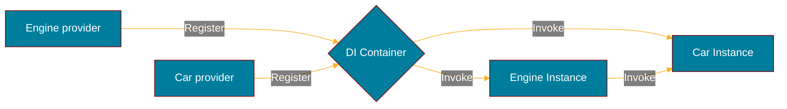

# Getting started

Discover **samber/do in less than 5 minutes**.

## What you'll need

Compatible with [Go](https://go.dev/doc/install/) 1.18 or later.

This library has no dependencies except the Go std lib.

Import package:

```sh
go get -u github.com/samber/do/v2
```

## Create a DI container

The simplest way to start is to use the default options:

```go
import "github.com/samber/do/v2"

injector := do.New()
```

## Service registration and invocation

Services can be declared as a singleton or a factory. In this example, we create two services, `Car` and `Engine`, with a simple dependency relationship.



Engine:

```go
// Provider
func NewEngine(i do.Injector) (*Engine, error) {
    return &Engine{
        Started: false,
    }, nil
}

type Engine struct {
    Started bool
}

func (e *Engine) Shutdown() error {
    // called on injector shutdown
    e.Started = false
    return nil
}
```

Car:

```go
// Provider
func NewCar(i do.Injector) (*Car, error) {
    return &Car{
        // import dependency
        Engine: do.MustInvoke[*Engine](i),
    }, nil
}

type Car struct {
    Engine *Engine
}

func (c *Car) Start() {
    c.Engine.Started = true
    println("vroooom")
}
```

### Register services using individual declaration

```go
func main() {
    // create DI container and inject package services
    injector := do.New()

    do.Provide(injector, NewCar)
    do.Provide(injector, NewEngine)
    do.ProvideValue(injector, &Config{
        Port: 4242,
    })

    // invoking car will instantiate Car services and its Engine dependency
    car, err := do.Invoke[*Car](injector)
    if err != nil {
        log.Fatal(err.Error())
    }

    car.Start() // that's all folks 🤗

    // handle ctrl-c and shutdown services
    injector.ShutdownOnSignals(syscall.SIGTERM, os.Interrupt)
}
```

### Register services using package declaration

The services can be assembled into a package, and then, imported all at once into a new container.

```go
var Package = do.Package(
    do.Lazy(NewCar),
    do.Lazy(NewEngine),
    do.Eager(&Config{
        Port: 4242,
    }),
)

func main() {
    // create DI container and inject package services
    injector := do.New(Package)

    // invoking car will instantiate Car services and its Engine dependency
    car, err := do.Invoke[*Car](injector)
    if err != nil {
        log.Fatal(err.Error())
    }

    car.Start()  // that's all folks 🤗

    // handle ctrl-c and shutdown services
    injector.ShutdownOnSignals(syscall.SIGTERM, os.Interrupt)
}
```
