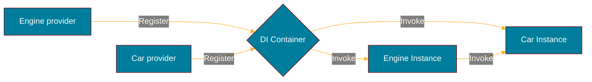

import Tabs from '@theme/Tabs';
import TabItem from '@theme/TabItem';

# Getting started

Discover **samber/do in less than 5 minutes**.

## What you'll need

Compatible with [Go](https://go.dev/doc/install/) 1.18 or later.

This library has no dependencies except the Go std lib.

Import package:

```sh
go get -u github.com/samber/do/v2
```

## Create a DI container

The simplest way to start is to use the default options:

**Play: <https://go.dev/play/p/g549GqBbj-n>**

```go
import "github.com/samber/do/v2"

injector := do.New()
```

## Service registration and invocation

Services can be declared as a singleton or a factory. In this example, we create two services, `Car` and `Engine`, with a simple dependency relationship.



### Declare constructors and invoke singleton

<Tabs>
  <TabItem value="car" label="car.go" default>
    ```go
    // Provider
    func NewCar(i do.Injector) (*Car, error) {
        return &Car{
            // import dependency
            Engine: do.MustInvoke[*Engine](i),
            Wheels: [4]*Wheel{
                do.MustInvokeNamed[*Wheel](i, "front-left"),
                do.MustInvokeNamed[*Wheel](i, "front-right"),
                do.MustInvokeNamed[*Wheel](i, "back-left"),
                do.MustInvokeNamed[*Wheel](i, "back-right"),
            },
        }, nil
    }

    type Car struct {
        Engine *Engine
        Wheels [4]*Wheel
    }

    func (c *Car) Start() {
        c.Engine.Started = true
        println("vroooom")
    }
    ```

  </TabItem>
  <TabItem value="engine" label="engine.go">
    ```go
    // Provider
    func NewEngine(i do.Injector) (*Engine, error) {
        return &Engine{
            Started: false,
        }, nil
    }

    type Engine struct {
        Started bool
    }

    func (e *Engine) Shutdown() error {
        // called on injector shutdown
        e.Started = false
        return nil
    }
    ```

  </TabItem>
  <TabItem value="wheel" label="wheel.go" default>
    ```go
    // Provider
    func NewWheel(i do.Injector) (*Wheel, error) {
        return &Wheel{
            Front: false,
            Left: true,
        }, nil
    }

    type Wheel struct {
        Front bool
        Left  bool
    }

    func (e *Engine) Brake() {
        // stuff
    }
    ```

  </TabItem>
</Tabs>

### Register services using individual declaration

<Tabs>
  <TabItem value="main" label="main.go" default>
    ```go
    func main() {
        // Create DI container and inject services
        injector := do.New()

        do.Provide(injector, NewCar)
        do.Provide(injector, NewEngine)
        do.ProvideNamed(injector, "front-left", NewWheel)
        do.ProvideNamed(injector, "front-right", NewWheel)
        do.ProvideNamed(injector, "back-left", NewWheel)
        do.ProvideNamed(injector, "back-right", NewWheel)
        do.ProvideValue(injector, &Config{
            Port: 4242,
        })

        // Invoking Car will instantiate the singleton and its Engine+Wheel dependencies
        car, err := do.Invoke[*Car](injector)
        if err != nil {
            log.Fatal(err.Error())
        }

        car.Start() // that's all folks 🤗

        // Handle ctrl-c and shutdown services
        injector.ShutdownOnSignals(syscall.SIGTERM, os.Interrupt)
    }
    ```

  </TabItem>
</Tabs>

**Play: <https://go.dev/play/p/cp5wNpo-5wn>**

### Register services using package declaration

The services can be assembled into a package, and then, imported all at once into a new container.

<Tabs>
  <TabItem value="package" label="pkg/car/package.go" default>
    ```go
    package car

    // Export every services of a package and make them available in a single big provider
    var Package = do.Package(
        do.Lazy(NewCar),
        do.Lazy(NewEngine),
        do.LazyNamed("front-left", NewWheel),
        do.LazyNamed("front-right", NewWheel),
        do.LazyNamed("back-left", NewWheel),
        do.LazyNamed("back-right", NewWheel),
    )
    ```

  </TabItem>
  <TabItem value="main" label="cmd/main.go">
    ```go
    package main

    import "github.com/foo/bar/pkg/car"

    func main() {
        // Create DI container and inject services of the "car" package
        injector := do.New(car.Package)

        // The traditional DI methods still works
        do.ProvideValue(injector, &Config{
            Port: 4242,
        })

        // Invoking Car will instantiate the singleton and its Engine+Wheel dependencies
        c, err := do.Invoke[*car.Car](injector)
        if err != nil {
            log.Fatal(err.Error())
        }

        c.Start()  // that's all folks 🤗

        // Handle ctrl-c and shutdown services
        injector.ShutdownOnSignals(syscall.SIGTERM, os.Interrupt)
    }
    ```

  </TabItem>
</Tabs>

**Play: <https://go.dev/play/p/kmf8aOVyj96>**
