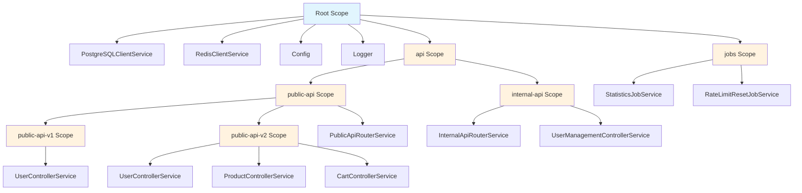

# Scope tree

## Spec

```go
do.ExplainInjector(do.Injector) do.ExplainInjectorOutput
```

## Print scope tree

```go
debug := do.ExplainInjector(scope)
println(debug.String())
```

Output:

```txt
Scope ID: 35d18a30-0cb9-4fad-aa3c-1438937612ad
Scope name: [root]

DAG:
 |
  \_ [root] (ID: 35d18a30-0cb9-4fad-aa3c-1438937612ad)
      * 😴 PostgreSQLClientService 🫀 🙅
      * 😴 RedisClientService 🫀 🙅
      * 🔁 Config
      * 🔗 Logger
      |
      |
      |\_ api (ID: dce6f365-fc52-4407-ac02-a6a857e0cbc9)
      |    |
      |    |
      |    |\_ public-api (ID: b9cac0c2-da74-4ee1-a5e0-eb30dca912c3)
      |    |    * 😴 PublicApiRouterService
      |    |    |     
      |    |    |
      |    |    |\_ public-api-v1 (ID: a4407628-5b3e-4abf-8d6d-82557d5ddb13)
      |    |    |    * 😴 UserControllerService
      |    |    |     
      |    |    |
      |    |     \_ public-api-v2 (ID: adc75f0a-a2dc-488f-9457-510e151d9e34)
      |    |         * 😴 UserControllerService
      |    |         * 😴 ProductControllerService
      |    |         * 😴 CartControllerService
      |    |          
      |    |
      |     \_ internal-api (ID: a9e3adfc-ad10-4cbd-9b0d-85cfad95d99c)
      |         * 😴 InternalApiRouterService
      |         * 😴 UserManagementControllerService
      |
      |
       \_ jobs (ID: 53406825-b7cc-46cc-9baf-ab0319c8a3bd)
           * 😴 StatisticsJobService
           * 😴 RateLimitResetJobService
```



Emojis describe service type:
- 😴 Lazy service
- 🔁 Eager service
- 🏭 Transient service
- 🔗 Service alias

...and capabilities:
- 🫀 Implements Healthchecker
- 🙅 Implements Shutdowner
